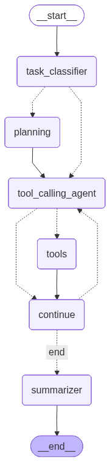

# Autonomous Multi-Agent System

An intelligent autonomous agent system built with LangGraph that can analyze task complexity, create todo lists, and autonomously call tools to complete user queries.

## Features

- **Intelligent Task Classification** - Automatically determines if queries are simple or complex
- **Autonomous Tool Calling** - Agent decides which tools to use and when
- **Real Web Search** - Powered by Tavily for current information
- **Async Architecture** - Full asynchronous execution for performance
- **Dynamic Todo Creation** - Breaks complex tasks into manageable steps

## Available Tools

- **Web Search** - Real-time internet search via Tavily API
- **HTTP Requests** - GET/POST requests to external APIs
- **Code Execution** - Safe Python code execution with restricted environment
- **Time/Date** - Current time and timezone information

## Quick Start

### Prerequisites
- Python 3.12+
- Ollama installed with models: `qwen2.5:latest` and `gemma3:1b`
- Tavily API key (get from [tavily.com](https://tavily.com))

### Installation

1. Clone the repository
```bash
git clone <repository-url>
cd autonomous-agent
```

2. Install dependencies
```bash
pip install -r requirements.txt
# or using uv (recommended for speed)
uv pip install -r requirements.txt
```

3. Set up environment variables
```bash
# Create .env file
echo "TAVILY_API_KEY=your_api_key_here" > .env
```

4. Run the system
```bash
python agents.py
```

## How It Works

The system uses an intelligent routing architecture:



**Flow Overview:**
- **task_classifier** analyzes query complexity
- **Simple queries** go directly to tool_calling_agent
- **Complex queries** route through planning first
- **tool_calling_agent** autonomously decides which tools to call
- **tools** node executes the selected tools
- **continue** processes tool results and checks progress
- **summarizer** creates final output for complex workflows

### Example Queries

**Simple Query:**
```
"What's the current time in UTC?"
```
Routes directly to tool agent -> Calls `get_time_info` -> Returns result

**Complex Query:**
```
"Research Python async patterns, write example code, and calculate execution time"
```
Routes to planning -> Creates todo list -> Executes with multiple tools -> Summarizes results

## Architecture

- **agents.py** - Complete system implementation
- **AgentState** - Shared state across all agents
- **LangGraph** - Orchestrates agent workflow and tool calling
- **Ollama Models** - Local LLM execution (GPU recommended)
- **Rich Console** - Colored output and progress indicators

## Configuration

### Model Requirements
- `qwen2.5:latest` - Main agent (requires ~8GB GPU memory)
- `gemma3:1b` - Supporting agent (lightweight)

### Environment Variables
```bash
TAVILY_API_KEY=your_tavily_api_key
```

## Development

### Code Quality
```bash
ruff check .    # Linting
ruff format .   # Formatting
```

### Extending Tools
Add new tools by:
1. Defining with `@tool` decorator
2. Adding to `tools` list
3. System automatically integrates via ToolNode

## License

MIT License