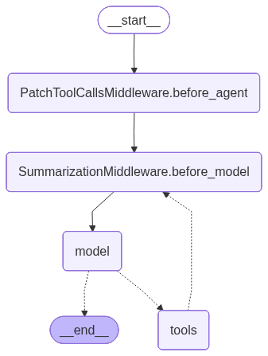

# E-Commerce Data Analysis Agent

A specialized data analysis helper agent system for e-commerce profitability analysis. Uses a coordinator agent with specialized subagents to process complex data queries and provide business insights.

## Features

- **Coordinator Agent** - Plans tasks, delegates to subagents, and synthesizes results
- **SQL Expert Subagent** - Database queries across 7 e-commerce tables
- **Data Analyst Subagent** - Python code execution, pandas operations, visualizations
- **Web Researcher Subagent** - Market research and external data integration via Tavily API
- **A2A Protocol Support** - Expose agents as A2A-compatible servers and call remote A2A agents
- **Multi-table Database** - 128k+ transaction records across Amazon sales, inventory, pricing, and B2B data
- **Dynamic Schema Awareness** - Automatically adapts to database changes without manual updates
- **Business Intelligence** - Profitability analysis, trend identification, and actionable recommendations
- **Built-in Task Planning** - Automatic task breakdown via `write_todos`
- **Context Management** - Large result offloading to filesystem (`.deepagents/` directory)

## Available Tools

- **SQL Query Tool** - Safe database queries with injection protection across e-commerce tables
- **Python Code Execution** - Full pandas/numpy/matplotlib environment for data analysis and visualization
- **Web Search** - Real-time market research and external data via Tavily API
- **A2A Call** (optional) - Communicate with remote A2A-compatible agents when `ENABLE_A2A=true`

## Quick Start

### Prerequisites
- Python 3.12+
- Ollama installed with model: `gpt-oss:20b-cloud`
- Tavily API key (get from [tavily.com](https://tavily.com))
- E-commerce dataset from Kaggle: [Unlock Profits with E-Commerce Sales Data](https://www.kaggle.com/datasets/thedevastator/unlock-profits-with-e-commerce-sales-data)

### Installation

1. Clone the repository
```bash
git clone <repository-url>
cd autonomous-agent
```

2. Install dependencies
```bash
uv sync
```

3. Download and setup database
```bash
# Download the Kaggle dataset and extract CSV files to csv-data/ folder
# https://www.kaggle.com/datasets/thedevastator/unlock-profits-with-e-commerce-sales-data

# Initialize SQLite database from CSV files
python setup_database.py
```

4. Set up environment variables
```bash
echo "TAVILY_API_KEY=your_api_key_here" > .env
```

5. Run the system
```bash
uv run python agents.py
```

### Running as an A2A Server

Expose your agent as an [A2A (Agent-to-Agent)](https://a2a-protocol.org/) compatible server:

```bash
uv run python run_a2a_server.py
```

The server starts on `http://localhost:8000` with hot reload enabled. Remote agents can discover and communicate with yours via the JSON-RPC endpoint.

**Test it with curl:**
```bash
# Fetch the agent card
curl http://localhost:8000/.well-known/agent-card.json

# Send a message
curl -X POST http://localhost:8000/ \
  -H "Content-Type: application/json" \
  -d '{
    "jsonrpc": "2.0",
    "id": "1",
    "method": "message/send",
    "params": {
      "message": {
        "role": "user",
        "parts": [{"kind": "text", "text": "What are the top 5 products by revenue?"}],
        "messageId": "test-1"
      }
    }
  }'
```

**Calling remote A2A agents** from the coordinator:
```bash
ENABLE_A2A=true uv run python agents.py
```

The coordinator will then have access to the `a2a_call` tool to communicate with any remote A2A-compatible agent.

## How It Works

The system uses a coordinator-subagent architecture powered by the [deepagents](https://pypi.org/project/deepagents/) framework:



**Flow Overview:**
- **Coordinator** - Analyzes queries, creates task plans, delegates to subagents, synthesizes results
- **SQL Expert** (`sql-expert`) - Database queries and e-commerce data retrieval
- **Data Analyst** (`data-analyst`) - Python code execution, pandas operations, visualizations
- **Web Researcher** (`web-researcher`) - Market research and external data gathering

### Example Queries

**Simple Data Query:**
```
"Show me the top 10 selling products by revenue"
```
Coordinator delegates to sql-expert → Executes database query → Returns formatted results

**Complex Analysis:**
```
"Analyze profitability across all marketplaces, identify trends, and recommend optimization strategies"
```
Coordinator creates task plan → Delegates to sql-expert (data) + data-analyst (analysis) + web-researcher (market context) → Synthesizes business insights

## Architecture

The system uses a coordinator-subagent architecture powered by the [deepagents](https://pypi.org/project/deepagents/) framework:


**Flow Overview:**
- **Coordinator** - Analyzes queries, creates task plans, delegates to subagents, synthesizes results
- **SQL Expert** (`sql-expert`) - Database queries and e-commerce data retrieval
- **Data Analyst** (`data-analyst`) - Python code execution, pandas operations, visualizations
- **Web Researcher** (`web-researcher`) - Market research and external data gathering

```
                    +------------------+
                    |    User (CLI)    |
                    +--------+---------+
                             |
                    +--------v---------+
                    |  Coordinator     |  (gpt-oss:20b-cloud via Ollama)
                    |  DeepAgent       |  tools=[a2a_call?]
                    |                  |  subagents=[sql-expert, data-analyst, web-researcher]
                    +--------+---------+
                             |
            +----------------+----------------+
            |                |                |
   +--------v------+ +------v--------+ +-----v----------+
   |  sql-expert   | | data-analyst  | | web-researcher |
   |  subagent     | | subagent      | | subagent       |
   |  tools:       | | tools:        | | tools:         |
   |   sql_query   | |  execute_code | |  web_search    |
   +---------------+ +---------------+ +----------------+
            |                |                |
            v                v                v
   +----------------+ +-------------+ +-------------+
   | ecommerce_data | | Python exec | | Tavily API  |
   | .db (SQLite)   | | (pandas,    | |             |
   | 7 tables, 128k+| |  matplotlib)| |             |
   +----------------+ +-------------+ +-------------+

A2A Protocol Layer (optional):
   +------------------+     +------------------+
   | A2A Server       |     | A2A Client Tool  |
   | (run_a2a_server) |     | (ENABLE_A2A=true)|
   | Wraps the entire |     | Lets coordinator |
   | agent graph as   |     | call remote A2A  |
   | JSON-RPC endpoint|     | compatible agents|
   +------------------+     +------------------+
```

## Configuration

### Model Requirements
- `gpt-oss:20b-cloud` - Coordinator and subagent model

### Environment Variables
```bash
TAVILY_API_KEY=your_tavily_api_key
ENABLE_A2A=false              # Set to true to enable A2A client tool on coordinator
A2A_HOST=0.0.0.0             # A2A server bind host (default: 0.0.0.0)
A2A_PORT=8000                # A2A server port (default: 8000)
```

## Development

### Code Quality
```bash
ruff check .    # Linting
ruff format .   # Formatting
```

### Extending the System
Add new data sources by:
1. Adding CSV files to `csv-data/` folder
2. Running `python setup_database.py` to regenerate database
3. Database schemas auto-update with dynamic injection

Add new subagents by:
1. Define subagent dict with required keys: `name`, `description`, `system_prompt`, `tools`
2. Add to the `subagents` list in `create_ecommerce_agent()`
3. Add corresponding entry in the coordinator's system prompt under "Available Subagents"

Add new tools by:
1. Define in `tools.py` with `@tool` decorator
2. Assign to the appropriate subagent's `tools` list

### Project Structure
```
agents.py              # Coordinator and subagent definitions
tools.py               # Tool implementations (SQL, Python exec, web search)
database.py            # Database utilities and dynamic schema extraction
setup_database.py      # Database initialization from CSV files
generate_graph.py      # Agent graph visualization generator
run_a2a_server.py      # A2A server entry point
a2a_bridge/            # A2A protocol integration package
  __init__.py          # Public exports
  adapters.py          # Message translation (A2A <-> LangChain)
  server.py            # DeepAgentA2AExecutor + create_a2a_app()
  client_tool.py       # a2a_call LangChain tool for calling remote agents
csv-data/              # Source CSV files for the e-commerce dataset
ecommerce_data.db      # SQLite database (generated)
```

## License

MIT License
